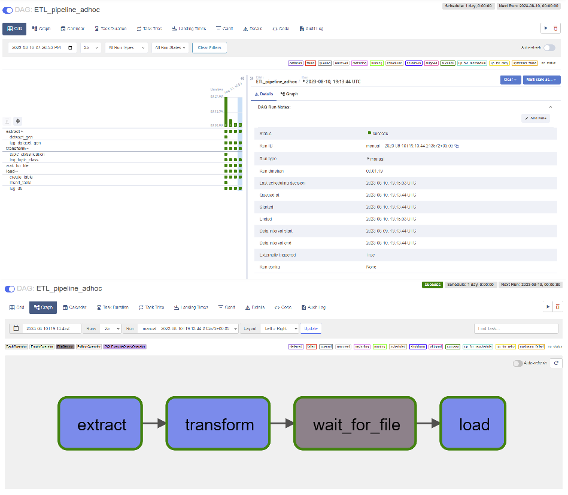

# NLPScreenplays.demo

Based on a tool developed as part of my PhD research.  

This 'lightweight' version furthermore features an ETL pipeline orchestrated w/ Apache Airflow:
- create a mock dataset 
- infer topics from textual data
- generate visualizations of results and performance metrics for evaluation
- load data into a relational database

---
### **Extract**
Via **webscraping** and **data pre-processing** techniques.  
This step is necessary to generate a suitable dataset as the data originally collected, which involved several human participants, is under a confidential agreement. To that end, <code>CreateDataset.py</code> collects movie scripts (i.e., parts and dialogues) and subtitles (timecodes and dialogues) from websites, preprocess those data files and renders a single formated table (<code>bttf.xlsx</code>).  

**Tools:** Selenium, BS4, HttpRequests, Pandas, regex patterns

### **Transform**
Via the **Latent LSTM Allocation** technique developed by Zaheer et al. (2021), which allows for joint clustering and non-linear modeling of unseen natural language textual segments, taking into account their spatial and temporal context.   
A gridsearch with 2-folds (originally 5-f) cross-validation is conducted to estimate the best parameters for both training the RNN and computing 'priors' (refered to as eta and theta in the literature) for the latent Dirichlet allocation. This step takes a long time to complete... be patient! Of course, you can turn down some params of the gridsearch pipeline directly in <code>MarTo.py</code>. 
Also, the layers of the RNN have been 'revisited' to lower overall time complexity which should serve this demo version better (at the cost of a lower accuracy though).
Finally, in the data folder, <code>custom_stopwords.txt</code> allows the user to manually list specific words to include/exclude from the data during preprocessing/cleaning. After the analysis has been completed, generated figures (showing top members per topic, distribution of topics over time, and performance metrics) are saved in the data directory.

**Tools:** ScikitLearn, TensorFlow w/ Keras backend, Matplotlib

### **Load**
Finally, data is loaded into a **PostgreSQL** database. Once data is available, transactions are handled by an SQLOperator defined through a taskgroup in the directed acyclic graph (<code>Rflow.py</code>). Note that every step of the way, logging has been implemented as an EmptyOperator and that there in no monitoring reports generated (besides Airflow's logs), no backup scheduled or a stored procedure for commit/rollback, no db optimization, etc. In short: this pipeline is not ACID compliant. I will implement those as soon a possible (as for uploading tests scripts).     

**Tools:** Airflow operators, SQL queries

---
### Usage  
- running in a virtual environment (executing <code>startup.sh</code> 
                                    after <code>pip install -r requirements.txt</code> in your venv)
- running in a Docker container (building <code>Dockerfile</code>)

Either way, it requires an Xserver (if you are not on a debian-based plateform) to allow Selenium and Firefox to work.   
Moreover:   
    - in a virtual env, you will have to install Postgres and Airflow; the bash script will handle starting both services;  
    - in a container, you will have to handle port binding to localhost:8080; do not run the container in detached mode (you wouldn't be able to see the username and password unless you have Docker Desktop installed); also, there won't be any data persitence.

Once setup is completed, access the Airflow UI via your webbrowser (retrieve your credentials from the Airflow Standalone logs) and run the dag.

It should look like:    

